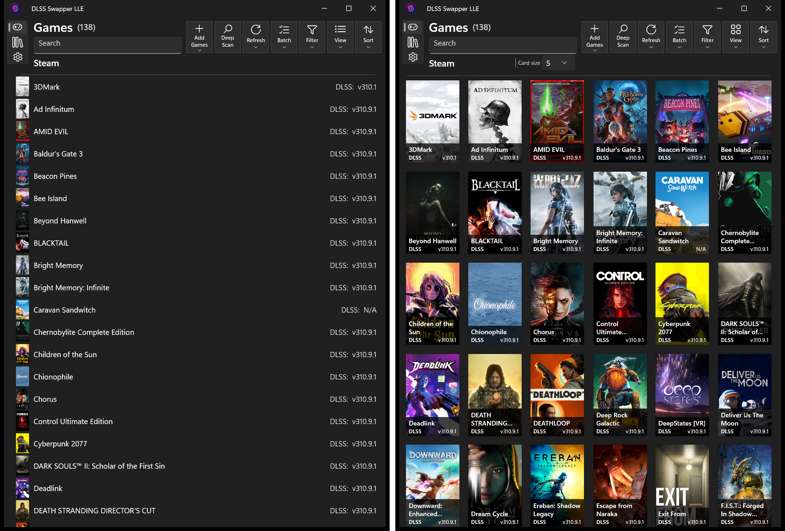

# DLSS Swapper LLE — Large Library Edition

DLSS Swapper LLE is a Windows and Linux fork built for managing large game
libraries. It combines fast library loading, adaptive scanning, a redesigned
interface and bulk workflows for importing games, choosing launch executables
and updating DLSS, FSR, XeSS and Streamline components.

**LLE V1** is based on upstream **DLSS Swapper v1.2.5.0**, with selected fixes,
DLL catalog updates and translations from later upstream releases.

[Releases](https://github.com/ordinarybob/dlss-swapper-lle/releases) ·
[Complete feature list](docs/FEATURE_CLUSTERS.md) ·
[Individual commits](docs/COMMITS.md) ·
[Screenshots](docs/SCREENSHOTS.md) ·
[Linux guide](linux/README.md) · [Build from source](docs/BUILDING.md)

## Headline features

- **Fast library loading.** Cached games become usable while scanning, artwork
  and metadata continue loading in the background. Adaptive Fast Scan reuses
  learned paths; Deep Scan searches the full game folder. A 4,000-game Steam
  library fully scans in approximately 30 seconds.
- **Performance controls for different systems.** HDD and standard storage
  profiles, with adjustable scanning, artwork, game-update and interface
  workloads. Scan and artwork limits can be changed while work is running.
- **Redesigned interface.** Responsive navigation and toolbars, adjustable cover
  grids, sorting, compact dialogs and direct game actions from context menus.
- **Bulk game import and launch setup.** Add several game folders or the games
  inside one parent folder. Scan launch executables together, then review every
  game in one scrollable window with a selector and Browse button on each row.
- **One-click update-all and parallel batch updates.** Choose the latest or a
  specific version for each DLL family across selected games. Apply NVIDIA
  presets in batches on Windows and copy or save the results.
- **Streamline version management.** Browse historical SDK releases, compare
  installed, available and original components, and switch versions for one or
  many games. Restore saved originals or recover interrupted updates.
- **Automatic artwork and shared caching.** Resolve covers for manually added
  games and reuse cached artwork. Windows portable instances can share the
  artwork cache beside a game library.
- **Native Linux desktop and CLI.** Manage the same saved library through the
  desktop interface or command line, including discovery, scanning, updates
  and restoration.

*Windows Games page. [Interface and workflow gallery](docs/SCREENSHOTS.md).*

## Downloads

- **Windows x64 portable:** [Download ZIP](https://github.com/ordinarybob/dlss-swapper-lle/releases/download/v1.0.0/DLSS.Swapper-LLE-1.0.0-windows-x64-portable.zip)
- **Linux x64 desktop and CLI:** [Download tar.gz](https://github.com/ordinarybob/dlss-swapper-lle/releases/download/v1.0.0/DLSS.Swapper-LLE-1.0.0-linux-x64.tar.gz)

Both packages include the .NET runtime. Extract the Windows ZIP and run
`DLSS Swapper LLE.exe`; extract the Linux archive and run
`./dlss-swapper-linux-gui` or `./dlss-swapper-linux --help`.

## Getting started

1. Start LLE. Choose **HDD** if your games are on a mechanical hard drive, or
   **Standard** for SSD storage. LLE discovers installed games from enabled
   launchers and scans their folders for supported DLLs.
2. For games outside those launchers, use **Add Games** to select one folder,
   several folders, or a parent folder containing multiple games. Launch setup
   lists the imported games together: choose each game's executable from its
   dropdown or use **Browse**, then **Save and close**.
3. Click a game to see its installed DLL versions. Click a DLL family to choose
   a replacement version or restore its saved original. For several games,
   choose **Batch**, select the games and click **Apply updates**. Choose versions
   individually or click **Update detected DLLs to latest**, then **Apply**.
4. Use **Library** to download versions in advance. **Streamline** lists SDK
   releases; the game's **Streamline components** window lets you select a
   release, compare its components and apply or restore them.

Close affected games before replacing files and keep their `.dlsss` backups.
Game updates, file verification and anti-cheat systems may reject modified DLLs.

## Platforms and game libraries

| Platform | Requirements | Discovery |
| --- | --- | --- |
| Windows x64 | Windows 10 build 19041 or newer | Steam, GOG, Epic, Ubisoft Connect, Xbox App, Battle.net and manual imports |
| Linux x64 | glibc 2.38 or newer and a desktop session for the GUI | Native/Flatpak Steam, Legendary/Heroic, supported launchers in configured Wine prefixes and manual imports |

See the [Linux guide](linux/README.md) for
dependencies, launcher setup and Windows-only controls.

## Release policy

LLE is a standalone release with no application updater or ongoing support commitment.
See [security and safe use](SECURITY.md).

## Credits and license

An unofficial fork of [beeradmoore/DLSS Swapper](https://github.com/beeradmoore/dlss-swapper).
The batch-selection foundation comes from RafaelHGOliveira's
[PR #913](https://github.com/beeradmoore/dlss-swapper/pull/913).

Distributed under [GPL-3.0](LICENSE). See [attribution](ATTRIBUTION.md) for
upstream and third-party credits, and the [changelog](CHANGELOG-LLE.md) for LLE V1.
