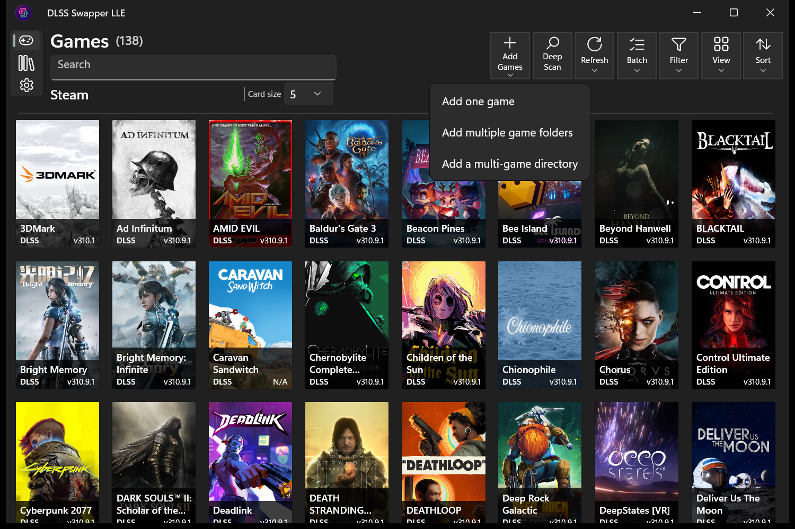

# LLE workflows

## Ultra fast library scanning

First library scan takes ~15 seconds for a 4,000-game Steam library, with cached
reloads instantaneous. LLE reads launcher records and scans game folders in
parallel. Adaptive Fast Scan checks known DLL locations; Deep Scan searches
complete game folders and learns new locations.

## Manual multi-game import

Add multiple games to the library in one operation:

- **Add multiple game folders:** select several individual game installation folders.
- **Add a multi-game directory:** select a parent directory and import each game folder immediately inside it.

Both modes skip duplicate entries and scan imported games for supported DLLs.

## Automatic executable detection and batch launch setup

After import, choose launch setup to scan all added games for launch executables.
Review the suggested executable for every game in one window, use Browse to
change individual selections, and save the whole batch together. Launch arguments
and working folders can be set separately for each game.

## One-click update-all and Streamline batch selection

Select the latest versions for every detected DLL type at once, choose a
Streamline SDK release, and apply those selections to multiple games
simultaneously. Files already current are skipped; the result report lists
changes and failures for each game.

## Streamline package library

Choose and download an NVIDIA Streamline SDK release. Use its component DLLs
to upgrade or downgrade the existing Streamline files in one or several games.

[Native Linux desktop and CLI](../linux/README.md) · [Overview](../README.md) · [LLE features](FEATURE_CLUSTERS.md)
