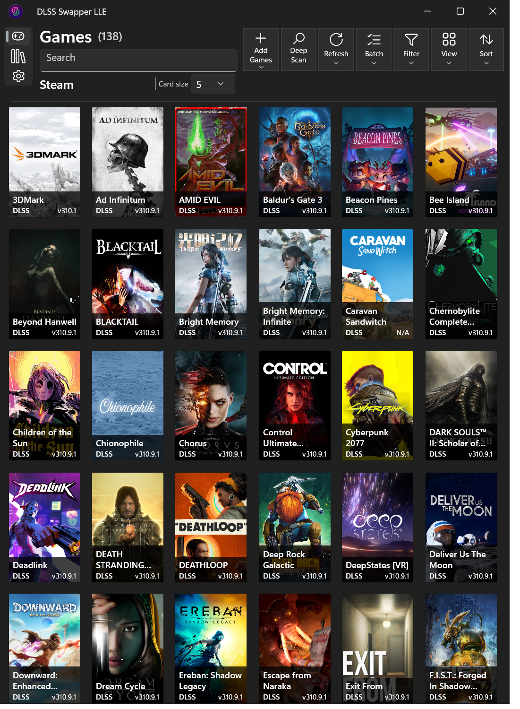
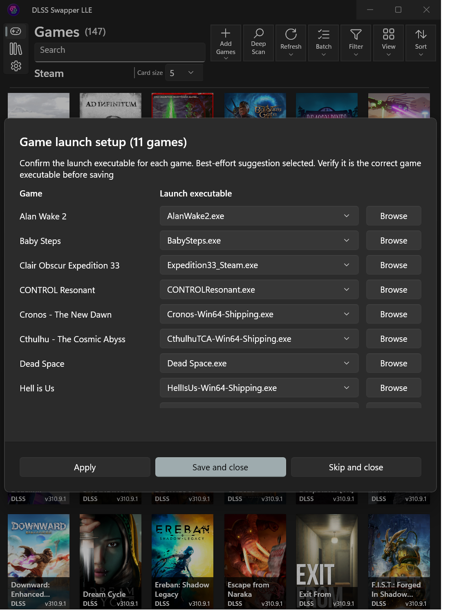
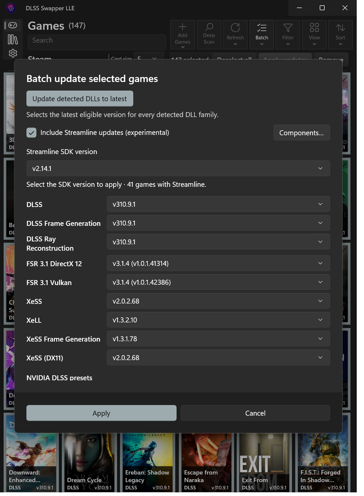
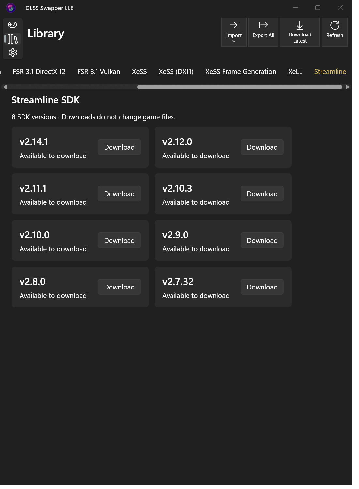

# LLE workflows

Four workflows in the Windows V1 release.

## Large game libraries

LLE's redesigned Games page brings Deep Scan, batch actions, sorting and
per-library card density into the toolbar above the game library.

## Bulk game import and launch setup

Import several game folders or a parent folder, scan the whole group for launch
executables, then review the suggestions together. Each game has an executable
selector and Browse button; Apply and Save and close handle the list together.

## One-click update-all and Streamline batch selection

Select the latest eligible DLL versions together and include a specific Streamline
SDK across the selected games. LLE adds parallel execution and Streamline selection
to the batch foundation from [upstream PR #913](https://github.com/beeradmoore/dlss-swapper/pull/913).

## Streamline package library

LLE adds historical Streamline SDK packages to the Library. Download a chosen
release for use in individual-game or batch component updates.

[Overview](../README.md) · [LLE changes](FEATURE_CLUSTERS.md)
